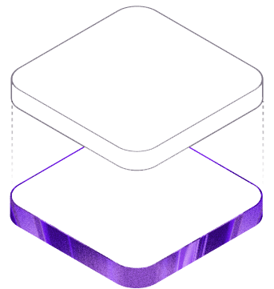
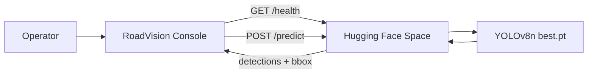

<p align="center">
  
</p>

<h1 align="center">RoadVision AI</h1>

<p align="center">
  <strong>React 19 · Vite 8 · YOLOv8 · Canvas overlays · Dual theme</strong><br />
  <em>Computer vision console for real-time traffic sign detection in road-scene imagery.</em>
</p>

<p align="center">
  <a href="https://github.com/sidnei-almeida/roadvision-yolo-detection-console"><strong>View on GitHub</strong></a>
  &nbsp;·&nbsp;
  <a href="https://inelialmeida-roadsign-detection-yl.hf.space">Hugging Face Space (API)</a>
  &nbsp;·&nbsp;
  <a href="https://www.kaggle.com/datasets/andrewmvd/road-sign-detection">Kaggle Dataset</a>
</p>

<p align="center">
  
  
  
  
  
  
  
</p>

---

## What this is

A **dark-first, portfolio-grade detection console** that connects to a [YOLOv8](https://docs.ultralytics.com/models/yolov8/) backend on Hugging Face Spaces. It turns raw road-scene images into an analyst workflow: load a sample or upload a frame, run inference, inspect bounding boxes on canvas, and review per-class confidence — all without leaving the browser.

The UI does **not** embed a model locally. Every detection flows through the production API (or your own HF Space URL via environment variables).

> **Production API:** `https://inelialmeida-roadsign-detection-yl.hf.space` — fine-tuned on the [Kaggle Road Sign Detection](https://www.kaggle.com/datasets/andrewmvd/road-sign-detection) dataset (877 images · 1,244 VOC annotations · 4 classes).

---

## Views & workflow

| View | Purpose |
|------|---------|
| **Live Detection** | Upload / sample images, canvas bbox overlay, detection summary sidebar |
| **Model Overview** | YOLOv8 architecture, training pipeline, hyperparameters, deployment stack |
| **Dataset & Classes** | Kaggle provenance, VOC→YOLO workflow, `data.yaml`, class reference |
| **Performance** | Session metrics, confidence distribution, per-class breakdown, latency benchmarks |
| **Inference Logs** | Terminal-style session log, predict events, timing snapshots |
| **API Status** | Health polling, endpoint contract, env vars, CORS troubleshooting |



---

## Main features

### Live detection workspace

- **Sample gallery** — 100+ curated road images from the dataset, served as static assets
- **Drag & drop upload** — client-side resize before predict (`VITE_API_IMAGE_SIZE`)
- **Canvas bbox overlay** — pixel-accurate boxes drawn on the result panel with hover sync
- **Scanning state** — animated overlay while the HF Space warms up or infers on CPU
- **No mock fallback** — when the API is offline, the UI stays honest (no fake detections)

### Detection summary sidebar

- **KPI grid** — signs detected, avg confidence, top class, processing time (animated counters)
- **Detected signs table** — index, class icon, confidence bar, regulatory/warning/informational type
- **Expandable list** — *View all N detections* reveals full rows with bbox coordinates and area
- **Confidence distribution** — horizontal tier bars (high / medium / low) inside the sidebar

### Information panels

- **Model info card** — YOLOv8n specs, Kaggle dataset stats, Ultralytics stack
- **About card** — training narrative, class taxonomy, use cases (ADAS, smart mobility)
- **Inference logs** — compact session feed with link to full logs view

### System indicators

- **API status pill** — `checking` · `online` · `offline` · `waking` with live dot pulse
- **Health polling** — automatic `/health` check every 60 s with retry on cold start
- **Structured API logging** — CORS / timeout / network diagnostics in the browser console
- **Request deduplication** — superseded `/predict` calls are aborted to avoid queue inflation

---

## Design system

Built for long inspection sessions: deep navy base, neon-green accent, monospace metrics, and a refined light theme.

| Element | Implementation |
|---------|----------------|
| **Typography** | [Space Grotesk](https://fonts.google.com/specimen/Space+Grotesk) (UI) + [JetBrains Mono](https://www.jetbrains.com/lp/mono/) (scores, bboxes, logs) |
| **Themes** | Dual palette via `data-theme` — dark (`#080B10` base) and light (`#EEF1F5` base with card shadows) |
| **Theme toggle** | Pill switch with sun/moon thumb — persisted in `localStorage` |
| **Panels** | Surface cards with `1px` borders, no heavy glassmorphism |
| **Accent** | `#00FF87` (dark) · `#007A45` (light) — confidence bars, live pulse, active nav |
| **Class colors** | Speed Limit cyan · Stop red · Crosswalk green · Traffic Light amber |
| **Motion** | Staggered `fadeInUp` on load, animated stat counters, 300 ms expand on detection list |

Tokens live in `src/styles/tokens.css`, `theme.css`, `globals.css`, and `premium.css`.

---

## Detection classes

Fine-tuned on four traffic-sign categories from the Kaggle dataset:

| Class | Type | Color | Description |
|-------|------|-------|-------------|
| **Speed Limit** | Regulatory | `#00D4FF` | Circular speed restriction signs |
| **Stop** | Regulatory | `#FF4444` | Octagonal STOP signs at intersections |
| **Crosswalk** | Warning | `#00FF87` | Pedestrian crossing zones |
| **Traffic Light** | Informational | `#FFB800` | Signal heads at controlled intersections |

Confidence tiers in the UI:

| Tier | Range | Use in UI |
|------|-------|-----------|
| **High** | 0.80 – 1.00 | Solid accent bar — reliable detection |
| **Medium** | 0.50 – 0.79 | Amber bar — review recommended |
| **Low** | 0.00 – 0.49 | Muted bar — likely false positive |

---

## Tech stack

| Layer | Choice |
|-------|--------|
| Framework | React 19 + Vite 8 |
| Language | JavaScript (ES modules) |
| Styling | Plain CSS — design tokens, no Tailwind |
| Icons | Custom SVG (`PremiumIcons`, `DetectionIcons`) + Lucide (menu) |
| Inference API | Hugging Face Space — FastAPI + Ultralytics YOLOv8 |
| Image prep | Canvas resize / crop client-side before `POST /predict` |
| Deploy | Vercel (static SPA) + HF Space (GPU/CPU backend) |

---

## Environment

Copy `.env.example` to `.env`:

```env
VITE_API_BASE_URL=https://inelialmeida-roadsign-detection-yl.hf.space
VITE_API_IMAGE_SIZE=416
```

| Variable | Required | Description |
|----------|----------|-------------|
| `VITE_API_BASE_URL` | Yes | HF Space base URL (no trailing slash, no `/predict`) |
| `VITE_API_IMAGE_SIZE` | No | YOLO inference size — `416` for CPU, `640` for GPU. Default: `416` |

The browser calls the HF Space **directly** (no Vercel proxy). The backend must allow your frontend origin in `CORS_ORIGINS`.

> **Vercel:** add the same variables under *Project Settings → Environment Variables*. `VITE_*` vars are baked in at build time — redeploy after changes.

---

## Quick start

```bash
git clone https://github.com/sidnei-almeida/roadvision-yolo-detection-console.git
cd roadvision-yolo-detection-console

npm install
cp .env.example .env   # adjust HF Space URL if needed

npm run dev
```

Open [http://localhost:5173](http://localhost:5173).

> **Note:** If the HF Space has slept, the first health check may take **30–60 seconds**. The API pill shows `waking` until `/health` returns `ready`.

### Production build

```bash
npm run build    # output → dist/
npm run preview  # local preview of production bundle
```

Requires **Node.js 20+** (see `.nvmrc`).

---

## Deploy on Vercel

The repo ships with `vercel.json` — Vite preset, SPA rewrite, security headers, and asset caching.

1. Import this repository on [Vercel](https://vercel.com/new).
2. Framework preset: **Vite** (auto-detected).
3. Environment variables:

   | Name | Value |
   |------|-------|
   | `VITE_API_BASE_URL` | `https://your-space.hf.space` |
   | `VITE_API_IMAGE_SIZE` | `416` or `640` |

4. Deploy.

5. Add your Vercel URL to `CORS_ORIGINS` on the HF Space:

   ```
   https://<your-project>.vercel.app
   ```

### Post-deploy checklist

- [ ] Page loads at `https://<project>.vercel.app`
- [ ] API pill turns green after HF Space warm-up
- [ ] Sample image triggers detection with canvas boxes
- [ ] Image upload works end-to-end
- [ ] Dark / light theme persists across reloads

### Troubleshooting

| Issue | Fix |
|-------|-----|
| API offline in prod, OK locally | Add `.vercel.app` origin to HF Space CORS |
| `failed to fetch` on predict | Space asleep, CORS misconfigured, or wrong `VITE_API_BASE_URL` |
| Slow inference (2–5 s) | HF Space on CPU — lower `VITE_API_IMAGE_SIZE` or enable GPU |
| Env var not applied | Redeploy after saving variables in Vercel dashboard |
| 404 on page refresh | `vercel.json` already rewrites to `index.html` |

---

## Repository structure

```
roadvision-yolo-detection-console/
├── images/
│   └── header.png              # README hero
├── public/
│   ├── samples/                # 100+ road-scene sample images
│   ├── favicon.svg
│   └── robots.txt
├── src/
│   ├── components/
│   │   ├── views/              # Model, Dataset, Performance, Logs, API pages
│   │   ├── icons/              # Premium + detection SVG icons
│   │   ├── Dashboard.jsx       # Live detection layout
│   │   ├── DetectionPanel.jsx  # Canvas bbox renderer
│   │   └── DetectionSummary.jsx
│   ├── data/                   # Kaggle metadata, navigation, sample index
│   ├── services/api.js         # HF Space client (health, predict, metadata)
│   ├── styles/                 # tokens.css, theme.css, globals.css, premium.css
│   └── utils/                  # detectionMapper, imageProcessing, formatters
├── readme_model.md             # README style reference
├── vercel.json                 # Vercel deploy config
├── .env.example
└── .nvmrc                      # Node 20
```

---

## API surface used by the UI

| Endpoint | Method | Purpose |
|----------|--------|---------|
| `/health` | GET | Space readiness — `status: ready` |
| `/model/info` | GET | Device, class names, PyTorch / Ultralytics versions |
| `/classes` | GET | Detectable class list |
| `/predict` | POST | Multipart `file` → detections, image dimensions, inference time |

Query params on predict: `image_size`, `conf_threshold` (default `0.25`).

---

## Dataset & model lineage

| Resource | Detail |
|----------|--------|
| **Dataset** | [Road Sign Detection](https://www.kaggle.com/datasets/andrewmvd/road-sign-detection) — Andrew Maranhão, 2020 |
| **Format** | PASCAL VOC XML → converted to YOLO `.txt` labels |
| **Model** | YOLOv8n fine-tuned · `best.pt` · anchor-free decoupled head |
| **Training** | Mosaic + MixUp + HSV jitter · 80/20 manual split · `imgsz=640` |
| **Backend** | Hugging Face Space · PyTorch + Ultralytics |
| **Frontend** | This repo · Vercel static deploy |

---

## Disclaimer

Detection outputs are for **computer vision demonstration, dataset validation, and portfolio showcase only**. They are not certified for autonomous driving, traffic enforcement, or safety-critical ADAS deployment. Always validate against ground truth and local regulations.

---

## License & author

**[MIT License](LICENSE)**

**Sidnei Alves de Almeida** — [@sidnei-almeida](https://github.com/sidnei-almeida)
