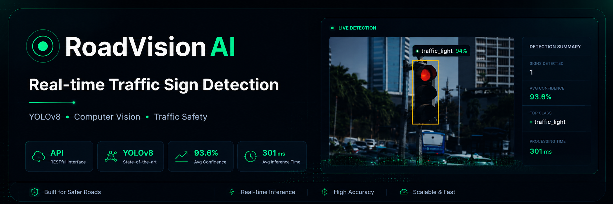
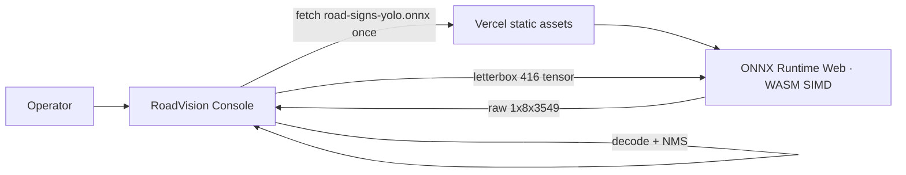

<p align="center">
  
</p>

<h1 align="center">RoadVision AI</h1>

<p align="center">
  <strong>React 19 · Vite 8 · YOLOv8 · Canvas overlays · Dual theme</strong><br />
  <em>Computer vision console for real-time traffic sign detection in road-scene imagery.</em>
</p>

<p align="center">
  <a href="https://github.com/sidnei-almeida/roadvision-yolo-detection-console"><strong>View on GitHub</strong></a>
  &nbsp;·&nbsp;
  <a href="https://onnxruntime.ai/docs/tutorials/web/">ONNX Runtime Web</a>
  &nbsp;·&nbsp;
  <a href="https://www.kaggle.com/datasets/andrewmvd/road-sign-detection">Kaggle Dataset</a>
</p>

<p align="center">
  
  
  
  
  
  
  
</p>

---

## What this is

A **dark-first, portfolio-grade detection console** that runs a fine-tuned [YOLOv8](https://docs.ultralytics.com/models/yolov8/) model **entirely in the browser**. It turns raw road-scene images into an analyst workflow: load a sample or upload a frame, run inference, inspect bounding boxes on canvas, and review per-class confidence — all without leaving the browser.

There is **no inference backend**. The `best.pt` checkpoint is exported to ONNX and shipped as a static asset next to the app; [ONNX Runtime Web](https://onnxruntime.ai/docs/tutorials/web/) compiles it to WASM SIMD on first load and every prediction runs locally. Nothing about the image ever leaves the device.

> **Model:** YOLOv8n fine-tuned on the [Kaggle Road Sign Detection](https://www.kaggle.com/datasets/andrewmvd/road-sign-detection) dataset (877 images · 1,244 VOC annotations · 4 classes), exported to ONNX opset 12 at a static `416×416` input.

---

## Views & workflow

| View | Purpose |
|------|---------|
| **Live Detection** | Upload / sample images, canvas bbox overlay, detection summary sidebar |
| **Model Overview** | YOLOv8 architecture, training pipeline, hyperparameters, deployment stack |
| **Dataset & Classes** | Kaggle provenance, VOC→YOLO workflow, `data.yaml`, class reference |
| **Performance** | Session metrics, confidence distribution, per-class breakdown, latency benchmarks |
| **Inference Logs** | Terminal-style session log, predict events, timing snapshots |
| **Engine Status** | Model load cycle, asset contract, env vars, troubleshooting |


```mermaid
flowchart LR
  USER[Operator]
  UI[RoadVision Console]
  VERCEL[Vercel static assets]
  ORT[ONNX Runtime Web · WASM SIMD]

  USER --> UI
  UI -->|fetch road-signs-yolo.onnx once| VERCEL
  VERCEL --> ORT
  UI -->|letterbox 416 tensor| ORT
  ORT -->|raw 1x8x3549| UI
  UI -->|decode + NMS| UI
```

---

## Main features

### Live detection workspace

- **Sample gallery** — 100+ curated road images from the dataset, served as static assets
- **Drag & drop upload** — image never leaves the device; letterboxed to `416×416` on canvas
- **Canvas bbox overlay** — pixel-accurate boxes drawn on the result panel with hover sync
- **Scanning state** — animated overlay while the local session runs the forward pass
- **No mock fallback** — if the model fails to load, the UI stays honest (no fake detections)

### Detection summary sidebar

- **KPI grid** — signs detected, avg confidence, top class, processing time (animated counters)
- **Detected signs table** — index, class icon, confidence bar, regulatory/warning/informational type
- **Expandable list** — *View all N detections* reveals full rows with bbox coordinates and area
- **Confidence distribution** — horizontal tier bars (high / medium / low) inside the sidebar

### Information panels

- **Model info card** — YOLOv8n specs, Kaggle dataset stats, Ultralytics stack
- **About card** — training narrative, class taxonomy, use cases (ADAS, smart mobility)
- **Inference logs** — compact session feed with link to full logs view

### System indicators

- **Engine status pill** — `checking` · `online` · `offline` with live dot pulse
- **Boot progress** — real download percentage for the ONNX weights, then compile and warmup phases
- **Structured logging** — preprocess / inference / postprocess timings in the browser console
- **Serialized inference** — one session run at a time; superseded requests are discarded

---

## Design system

Built for long inspection sessions: deep navy base, neon-green accent, monospace metrics, and a refined light theme.

| Element | Implementation |
|---------|----------------|
| **Typography** | [Space Grotesk](https://fonts.google.com/specimen/Space+Grotesk) (UI) + [JetBrains Mono](https://www.jetbrains.com/lp/mono/) (scores, bboxes, logs) |
| **Themes** | Dual palette via `data-theme` — dark (`#080B10` base) and light (`#EEF1F5` base with card shadows) |
| **Theme toggle** | Pill switch with sun/moon thumb — persisted in `localStorage` |
| **Panels** | Surface cards with `1px` borders, no heavy glassmorphism |
| **Accent** | `#00FF87` (dark) · `#007A45` (light) — confidence bars, live pulse, active nav |
| **Class colors** | Speed Limit cyan · Stop red · Crosswalk green · Traffic Light amber |
| **Motion** | Staggered `fadeInUp` on load, animated stat counters, 300 ms expand on detection list |

Tokens live in `src/styles/tokens.css`, `theme.css`, `globals.css`, and `premium.css`.

---

## Detection classes

Fine-tuned on four traffic-sign categories from the Kaggle dataset:

| Class | Type | Color | Description |
|-------|------|-------|-------------|
| **Speed Limit** | Regulatory | `#00D4FF` | Circular speed restriction signs |
| **Stop** | Regulatory | `#FF4444` | Octagonal STOP signs at intersections |
| **Crosswalk** | Warning | `#00FF87` | Pedestrian crossing zones |
| **Traffic Light** | Informational | `#FFB800` | Signal heads at controlled intersections |

Confidence tiers in the UI:

| Tier | Range | Use in UI |
|------|-------|-----------|
| **High** | 0.80 – 1.00 | Solid accent bar — reliable detection |
| **Medium** | 0.50 – 0.79 | Amber bar — review recommended |
| **Low** | 0.00 – 0.49 | Muted bar — likely false positive |

---

## Tech stack

| Layer | Choice |
|-------|--------|
| Framework | React 19 + Vite 8 |
| Language | JavaScript (ES modules) |
| Styling | Plain CSS — design tokens, no Tailwind |
| Icons | Custom SVG (`PremiumIcons`, `DetectionIcons`) + Lucide (menu) |
| Inference | ONNX Runtime Web (`onnxruntime-web/wasm`) — WASM SIMD, in-browser |
| Model | YOLOv8n → ONNX opset 12, static `1×3×416×416` input, `1×8×3549` output |
| Image prep | Canvas letterbox (pad 114) → float32 NCHW, normalized to `[0,1]` |
| Postprocess | Anchor-free decode + per-class NMS in JavaScript |
| Deploy | Vercel — 100% static, no serverless functions |

---

## Environment

**Every variable is optional** — the app runs with zero configuration. Copy `.env.example` to `.env` only if you want to override a default:

```env
VITE_MODEL_URL=/models/road-signs-yolo.onnx
VITE_CONF_THRESHOLD=0.25
VITE_IOU_THRESHOLD=0.45
```

| Variable | Default | Description |
|----------|---------|-------------|
| `VITE_MODEL_URL` | `/models/road-signs-yolo.onnx` | Path to the ONNX weights |
| `VITE_MODEL_META_URL` | `/models/road-signs-yolo.json` | Manifest with class names and tensor shapes |
| `VITE_CONF_THRESHOLD` | `0.25` | Minimum confidence to keep a detection |
| `VITE_IOU_THRESHOLD` | `0.45` | IoU threshold for per-class NMS |
| `VITE_ORT_WASM_PATH` | bundler-resolved | Override the directory serving the ORT `.wasm` |

> **Vercel:** add overrides under *Project Settings → Environment Variables*. `VITE_*` vars are baked in at build time — redeploy after changes.

---

## Quick start

```bash
git clone https://github.com/sidnei-almeida/roadvision-yolo-detection-console.git
cd roadvision-yolo-detection-console

npm install
npm run dev
```

Open [http://localhost:5173](http://localhost:5173).

> **Note:** the first load fetches ~12 MB of ONNX weights plus the ORT WASM runtime. The boot screen shows real download progress; subsequent loads are served from the immutable cache.

### Production build

```bash
npm run build    # output → dist/
npm run preview  # local preview of production bundle
```

Requires **Node.js 20+** (see `.nvmrc`).

---

## Deploy on Vercel

The repo ships with `vercel.json` — Vite preset, SPA rewrite, security headers, and asset caching.

1. Import this repository on [Vercel](https://vercel.com/new).
2. Framework preset: **Vite** (auto-detected).
3. No environment variables are required.
4. Deploy.

There is no backend to provision and no serverless function — the whole app, including the model, is static output.

### Post-deploy checklist

- [ ] Page loads at `https://<project>.vercel.app`
- [ ] Boot screen shows weight download progress, then dismisses
- [ ] Sample image triggers detection with canvas boxes
- [ ] Image upload works end-to-end
- [ ] Dark / light theme persists across reloads

### Troubleshooting

| Issue | Fix |
|-------|-----|
| `Cannot load detection model` | Confirm `/models/road-signs-yolo.onnx` returns `200` on the deployment |
| Slow first load | ~12 MB weights + WASM runtime; later visits hit the 1-year immutable cache |
| Inference over 1 s | Expected on low-end mobile — WASM SIMD is CPU-bound |
| Env var not applied | Redeploy after saving variables in Vercel dashboard |
| 404 on page refresh | `vercel.json` already rewrites to `index.html` |

---

## Repository structure

```
roadvision-yolo-detection-console/
├── images/
│   └── readme-hero.png         # README hero banner
├── public/
│   ├── models/                 # road-signs-yolo.onnx + manifest (shipped weights)
│   ├── samples/                # 100+ road-scene sample images
│   ├── favicon.svg
│   └── robots.txt
├── src/
│   ├── components/
│   │   ├── views/              # Model, Dataset, Performance, Logs, API pages
│   │   ├── icons/              # Premium + detection SVG icons
│   │   ├── Dashboard.jsx       # Live detection layout
│   │   ├── DetectionPanel.jsx  # Canvas bbox renderer
│   │   └── DetectionSummary.jsx
│   ├── data/                   # Kaggle metadata, navigation, sample index
│   ├── services/
│   │   ├── api.js              # Facade: health, metadata, predict (local)
│   │   └── inference/          # session.js, preprocess.js, postprocess.js, engine.js
│   ├── styles/                 # tokens.css, theme.css, globals.css, premium.css
│   └── utils/                  # detectionMapper, imageProcessing, formatters
├── readme_model.md             # README style reference
├── vercel.json                 # Vercel deploy config
├── .env.example
└── .nvmrc                      # Node 20
```

---

## Inference pipeline

| Stage | Detail |
|-------|--------|
| Manifest | `GET /models/road-signs-yolo.json` — class names, input name, tensor shapes |
| Weights | `GET /models/road-signs-yolo.onnx` — streamed with progress, cached immutably |
| Session | `ort.InferenceSession.create(bytes, { executionProviders: ['wasm'] })` + warmup pass |
| Preprocess | Canvas letterbox to `416×416` (pad `114`) → `Float32Array` NCHW, `/255` |
| Forward | `session.run({ images })` → `Float32Array` of shape `1×8×3549` |
| Decode | Per-anchor argmax over 4 class channels, threshold, undo letterbox |
| NMS | Per-class greedy suppression at IoU `0.45` |

`src/services/api.js` keeps the original `getHealth` / `getMetadata` / `getClasses` / `predictImage` / `predictSample` surface, so the React tree was untouched by the migration.

### Re-exporting the model

```bash
pip install ultralytics onnx onnxslim
yolo export model=modelos/best.pt format=onnx imgsz=416 opset=12 simplify=True dynamic=False
```

Copy the result to `public/models/road-signs-yolo.onnx` and update `road-signs-yolo.json` if the class order or input size changes.

---

## Dataset & model lineage

| Resource | Detail |
|----------|--------|
| **Dataset** | [Road Sign Detection](https://www.kaggle.com/datasets/andrewmvd/road-sign-detection) — Andrew Maranhão, 2020 |
| **Format** | PASCAL VOC XML → converted to YOLO `.txt` labels |
| **Model** | YOLOv8n fine-tuned · `best.pt` · anchor-free decoupled head |
| **Training** | Mosaic + MixUp + HSV jitter · 80/20 manual split |
| **Export** | `best.pt` → ONNX opset 12 · static `1×3×416×416` · onnxslim |
| **Runtime** | ONNX Runtime Web · WASM SIMD · in-browser |
| **Frontend** | This repo · Vercel static deploy |

---

## Disclaimer

Detection outputs are for **computer vision demonstration, dataset validation, and portfolio showcase only**. They are not certified for autonomous driving, traffic enforcement, or safety-critical ADAS deployment. Always validate against ground truth and local regulations.

---

## License & author

**[MIT License](LICENSE)**

**Sidnei Alves de Almeida** — [@sidnei-almeida](https://github.com/sidnei-almeida)
